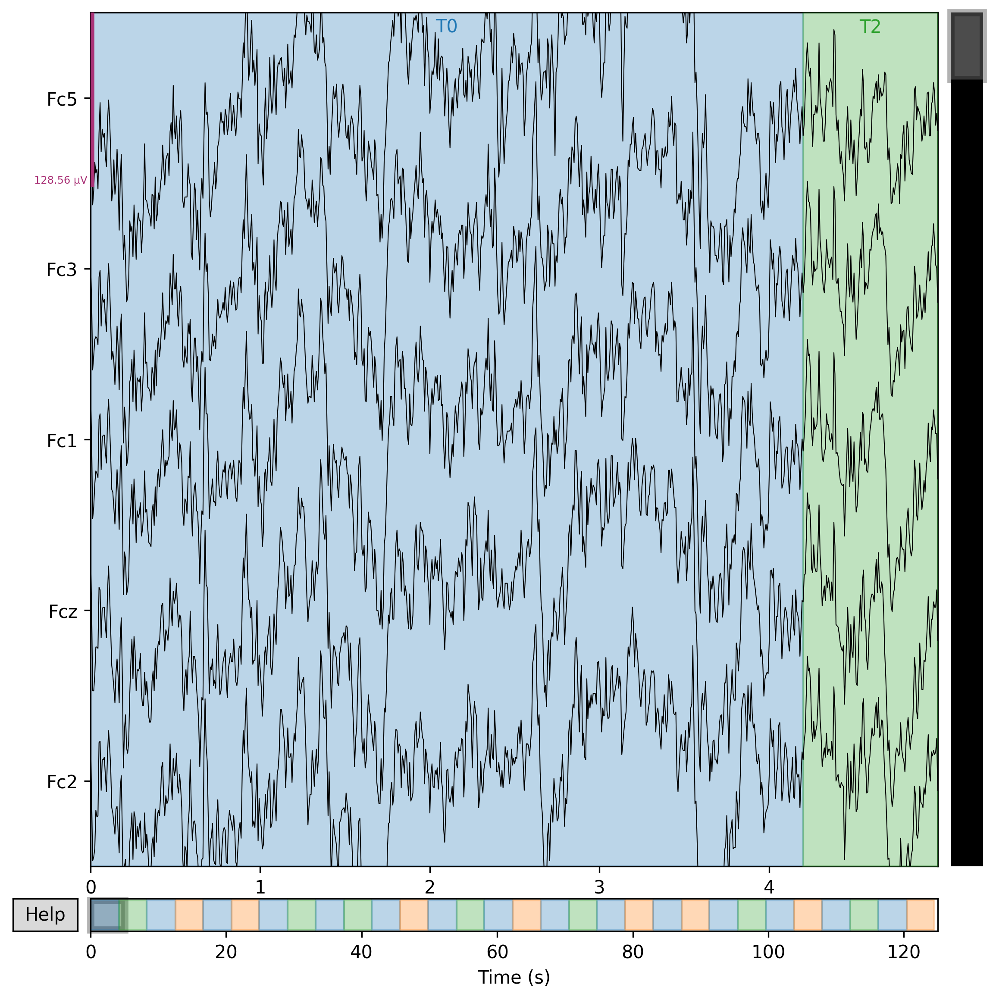
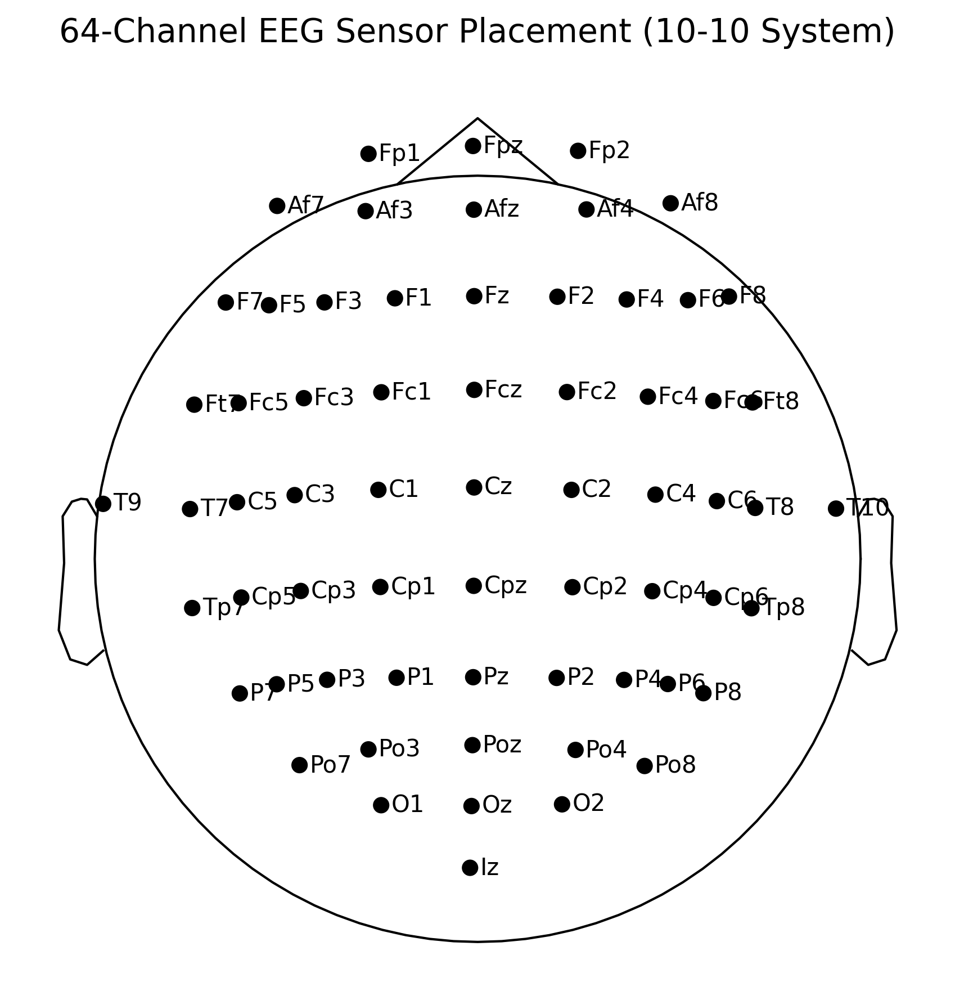

# EEG Data Loading & Spatial Visualization Pipeline using MNE-Python

*A beginner-friendly neuroscience project demonstrating the first stage of an EEG analysis workflow.*

---

# Motivation

### 🇬🇧 English

Coming from a Computer Science background, I thought the importance of understanding how raw biological signals are transformed into structured data, before applying machine learning algorithms.

Rather than jumping into classification models directly, I decided to first build a foundation by learning how EEG recordings are loaded, standardized, and visualized using MNE-Python, one of the most widely adopted open-source libraries in computational neuroscience.

### 🇰🇷 한국어

컴퓨터과학을 공부하면서 머신러닝 모델을 적용하기 이전에, 원시 생체신호가 어떻게 정리되고 분석 가능한 형태로 변환되는지 중요하다고 생각했습니다.

분류(Classification)부터 시작하기보다, 계산신경과학 분야에서 가장 널리 사용되는 MNE-Python을 활용하여 EEG 데이터의 구조와 전처리 과정을 기초부터 학습하기 위해 본 프로젝트를 진행했습니다.

---

# Project Objective

### 🇬🇧 English

This project implements the first stage of a reproducible EEG analysis pipeline.

The objectives:

- Load raw EEG recordings
- Inspect recording metadata
- Standardize EEG channel names
- Apply the international standard_1005 electrode montage
- Visualize electrode locations and raw EEG signals

This project serves as the foundation for future preprocessing and machine learning studies.

### 🇰🇷 한국어

본 프로젝트는 재현 가능한 EEG 분석 파이프라인의 첫 단계를 구현하는 것을 목표로 합니다.

주요 목표:

- 원시 EEG 데이터 불러오기
- 메타데이터 확인
- 채널 이름 표준화
- 국제 표준 standard_1005 전극 좌표계 적용
- EEG 파형 및 전극 위치 시각화

향후 Filtering, ICA, Feature Extraction, Classification 프로젝트의 기반이 되는 단계입니다.

---

# Dataset

### 🇬🇧 English

**PhysioNet EEG Motor Movement/Imagery Dataset**

- Public benchmark dataset
- 64-channel EEG
- Motor execution & motor imagery tasks

https://physionet.org/

### 🇰🇷 한국어

**PhysioNet EEG Motor Movement/Imagery Dataset**

- 국제 공개 EEG 벤치마크 데이터셋
- 64채널 EEG
- 운동 수행 및 운동 상상(Motor Imagery) 실험 데이터

---

# Tech Stack

### 🇬🇧 English

- Python
- MNE-Python
- NumPy
- SciPy
- Matplotlib
- Google Colab

### 🇰🇷 한국어

- Python
- MNE-Python
- NumPy
- SciPy
- Matplotlib
- Google Colab

---

# Repository Structure

```text
eeg-mne-pipeline/
├── README.md
├── requirements.txt
├── .gitignore
│
├── data/
│
├── figures/
│   ├── raw_eeg.png
│   └── sensor_topomap.png
│
├── notebooks/
│   └── 01_eeg_loading_visualization.ipynb  # Step 1 - 5
│   └── 02_eeg_signal_enhancement.ipynb     # Step 6 - 7
│   └── 03_eeg_epoching_features.ipynb      # (coming soon: 향후 데이터 자르기 단계)
│   └── 04_mi_machine_learning.ipynb        # (coming soon: 향후 머신러닝 분류 단계)
│
└── src/
```

---

# Workflow

### 🇬🇧 English
1. **Data Ingestion**: Load raw PhysioNet EEG recordings and inspect system metadata.
2. **Data Cleansing**: Standardize electrode string names and co-register the international `standard_1005` montage.
3. **Exploratory Visualization**: Render and verify the initial 2D sensor topography map and raw waveforms.
4. **Signal Enhancement**: Apply a 60Hz Notch filter to suppress power-line noise and a 1–40Hz Band-pass filter to isolate core Motor Imagery (Mu/Beta) rhythms.

### 🇰🇷 한국어
1. **데이터 로드**: 원시 PhysioNet EEG 녹음 데이터를 불러오고 시스템 메타데이터를 확인합니다.
2. **데이터 정제**: 전극 이름 문자열을 표준화하고 국제 표준 `standard_1005` 좌표계를 매핑합니다.
3. **탐색적 시각화**: 초기 2D 센서 지형도와 원시 뇌파 파형을 렌더링하고 시각적으로 검증합니다.
4. **신호 품질 강화**: 60Hz 노치 필터로 교류 전기 잡음을 제거하고, 1~40Hz 밴드패스 필터로 핵심 운동 상상 주파수(Mu/Beta 리듬) 영역만 깎아냅니다.

---

# Results

### 1. Continuous Time-Series EEG Signal
Below is the visual profile of the raw voltage fluctuations across the top 5 EEG channels during the first 5 seconds.


### 2. 64-Channel Sensor Topography Map
Below is the 2D spatial coordinate mapping of the 64-channel electrode matrix, perfectly co-registered over the motor cortex.


### 🇬🇧 English
The high-dimensional biological time-series data was standardized and anatomically mapped. By engineering targeted mathematical filters(Notch & Band-pass), power-line electrical Hums and physiological noise were stripped away, creating a clean, high-SNR input baseline for future machine learning steps.

### 🇰🇷 한국어
고차원 생체 시계열 데이터의 표준화와 해부학적 매핑을 했습니다. 또한 목적에 맞는 수학적 필터(노치 및 밴드패스) 엔지니어링을 통해 전력선 전기 잡음과 신체 노이즈를 깎아냄으로써 향후 머신러닝 분석을 위해 정제되고 신호 대 잡음비(SNR)가 높은 기초 데이터를 확보했습니다.

---

# What I Learned

### 🇬🇧 English
Through this hands-on engineering pipeline, I have built a concrete foundation in:
- **Matrix Metadata Handling**: Understanding how raw voltage potentials convert into programmable memory formats (`preload=True`).
- **Anatomical Space Co-registration**: Learning why assigning spatial coordinates is non-negotiable for biological data before feeding it to an AI.
- **Digital Noise Cleansing**: Understanding how physical environmental interferences (60Hz hum) and muscle movements affect signal integrity, and how to neutralize them mathematically.

This project reinforces my belief that high-quality biomedical data analytics always begins with defensive data engineering and strict preprocessing, rather than jumps directly into complex AI models.

### 🇰🇷 한국어
이번 파이프라인 구축 과정을 통해 다음 영역에서 탄탄한 기초 체력을 다질 수 있었습니다.
- **행렬 메타데이터 핸들링**: 날것의 전압 신호가 어떻게 프로그래밍 가능한 메모리 포맷으로 로드(`preload=True`)되는지 이해했습니다.
- **해부학적 공간 좌표 매핑**: 생체 신호를 인공지능에 먹이기 전에 왜 공간 좌표계를 부여하는 작업이 타협 불가능한 필수 단계인지 배웠습니다.
- **디지털 노이즈 정제**: 물리적인 환경 간섭(60Hz 콘센트 잡음)과 신체 움직임이 신호에 미치는 영향을 이해하고, 이를 수학적으로 중립화하는 방법을 익혔습니다.

화려하고 복잡한 AI 모델을 무작정 돌리기 전에, 방어적인 데이터 엔지니어링과 정석적인 전처리를 완수하는 것이 바이오메디컬 데이터 분석의 진짜 시작이라는 점을 깊이 깨달았습니다.

---

# Limitations

### 🇬🇧 English

This project focuses only on EEG loading and visualization.

The following components would be considered in future projects:

- Filtering
- Artifact Removal (ICA)
- Epoch Extraction
- Feature Engineering
- Motor Imagery Classification
- Deep Learning

### 🇰🇷 한국어

본 프로젝트는 EEG 데이터 로딩과 시각화만을 다룹니다.

향후 프로젝트에서는

- Filtering
- ICA
- Epoching
- Feature Extraction
- Classification
- Deep Learning

구현을 고려할 예정입니다.

---

# How to Run

```bash
pip install -r requirements.txt
```

or simply open the notebook in Google Colab and run all cells.

---

# Acknowledgement

### 🇬🇧 English

This project was independently developed for educational and portfolio purposes using publicly available datasets provided by PhysioNet and the MNE-Python ecosystem.

### 🇰🇷 한국어

본 프로젝트는 PhysioNet과 MNE-Python에서 제공하는 공개 데이터를 활용하여 학습 및 포트폴리오 목적으로 독립적으로 개발되었습니다.